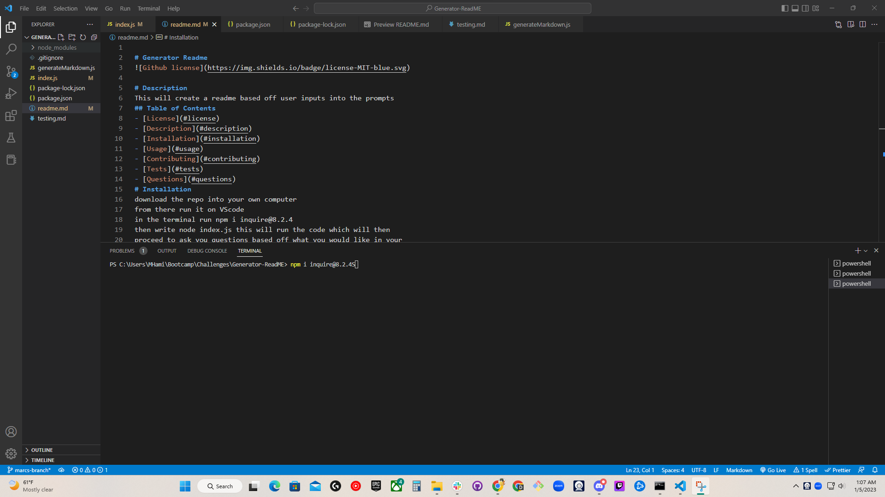

# Generator Readme

# Description
This will create a readme based off user inputs into the prompts

# Installation
download the repo into your own computer
from there run it on VScode
in the terminal run npm i inquire@8.2.4
then write node index.js this will run the code which will then
proceed to ask you questions based off what you would like in your
README.

# Contributing
Marc Hamilton, and the bootCampSpot starting code

# Questions
- If you have any questions for me please contact me at the locations below.
- My GitHub Profile: [Marcosauras](https://www.github.com/Marcosauras)
- Please email me at Mhamilton1300@outlook.com with any additional questions

